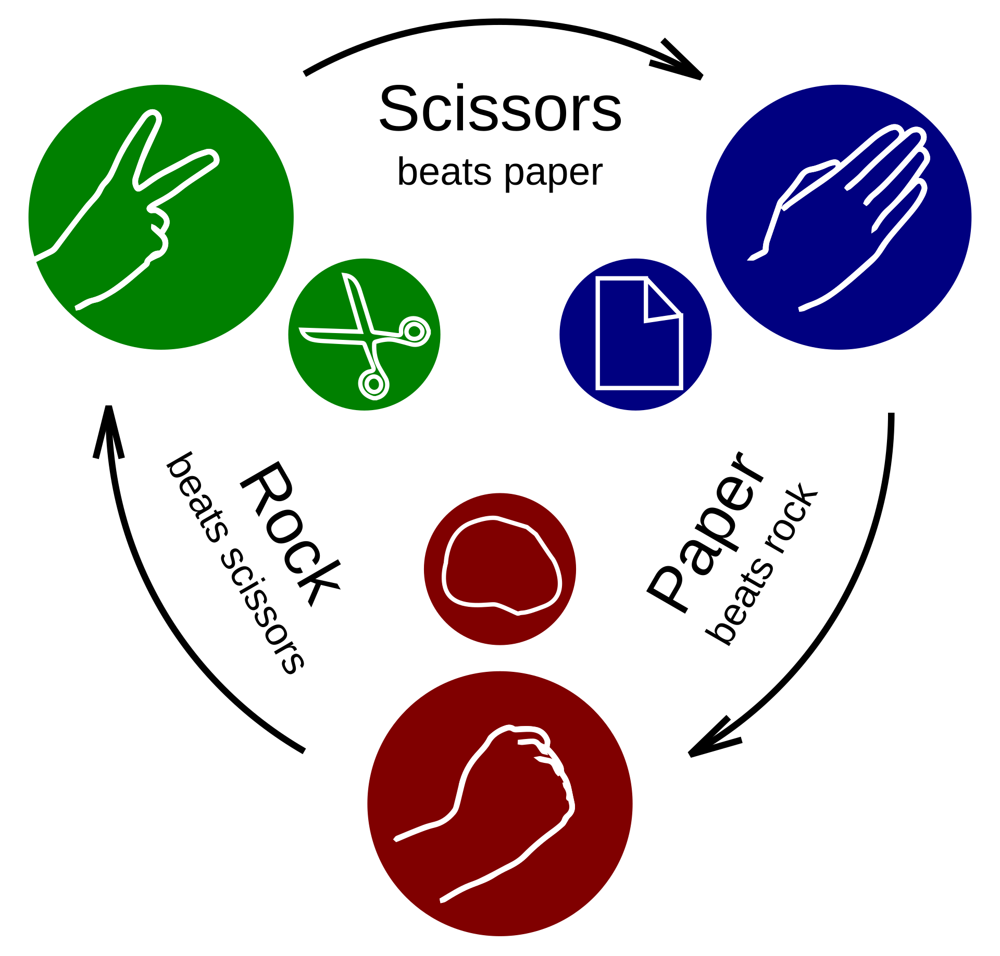
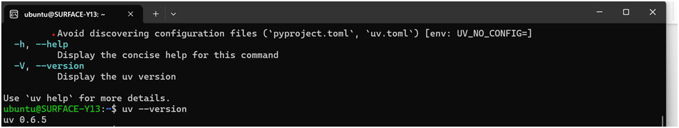
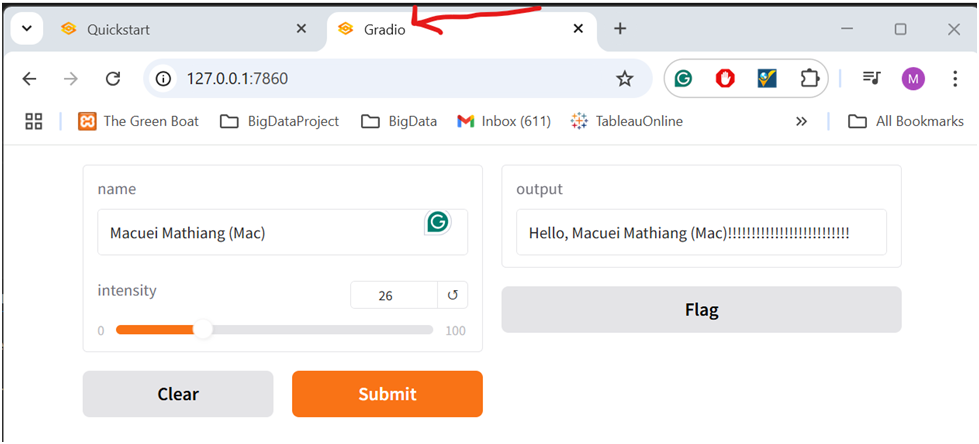
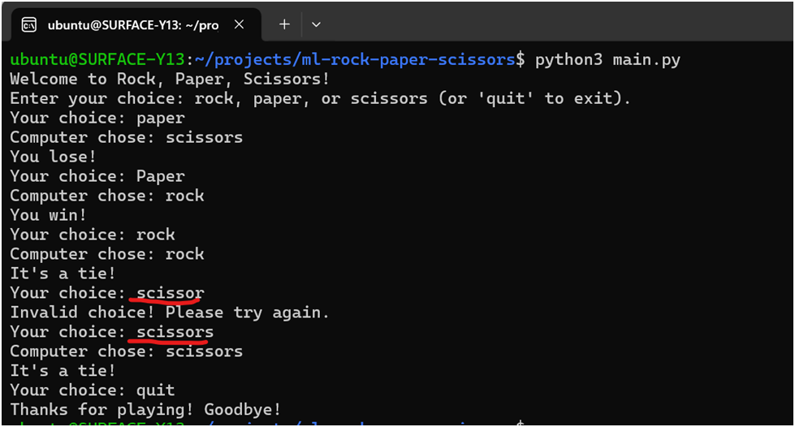

# The Rock, Paper, Scissors Game


This application enables users to engage in the classic Rock, Paper, Scissors game against a computer opponent. Upon initialization, the program displays a welcome message and provides comprehensive instructions for users to make their selection. The application then evaluates whether the user has won, tied, or lost against the computer's choice. The program continues to prompt the user for subsequent selections until they opt to quit, thereby terminating the application. The implementation primarily utilizes two fundamental Python programming concepts: loops for iterative processes and function definition and invocation.

## Table of Contents
- [Features](#features)
- [Getting Started](#getting-started)
- [Prerequisites](#prerequisites)
- [Installation](#installation)
- [Testing](#testing)

## Features
- Present a welcome message and instructions to the user via the console interface.
- Receive and process user inputs, comparing them against the computer's selection.
- Display the outcome of each decision until the user elects to terminate the program.


## Getting Started
Instructions for setting up the project:
- Acquired comprehensive knowledge regarding the rules governing the Rock, Paper, Scissors game.
- Developed a systematic algorithm for implementation, delineating each procedural step in sequential order.
- Executed the implementation phase, conducted thorough testing procedures, and enhanced the application with additional features.

### Prerequisites
What things you need to install and how to install them:
```bash
npm install npm@latest -g
```

### Installation
- Installed the following tools and technologies:
1. Python3
2. Microsoft VS Code IDE
3. Uv - the Python Package management tool
4. Gradio - one of the Python User Interface module
5. Obsidian - Effective notes taking
   

## Installing uv tool ###


- Run the following script on terminal: 
$ curl -LsSf https://astral.sh/uv/install.sh | sh
- Install “uv” using pip tool: 
$ pip install uv

- Upgrade “uv”:
$ pip install –upgrade uv




### Installing Gradio UI tool
- Use the following url to install it on your device:
https://www.gradio.app/guides/quickstart




## Testing the application ##


